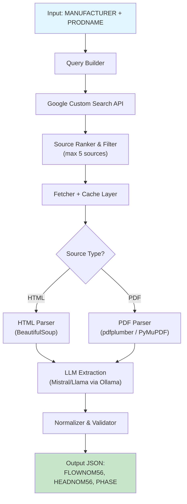

## 1. Workspace File Inventory

| File | Role | Key Content |
|---|---|---|
| `Details.md` | Project spec & architecture notes | Challenge objective, input/output fields, proposed 7-layer architecture, output schema |
| `data_description.pptx` | Visual data description | Column layout of the dataset (screenshot confirms column order and sample values) |
| `Replacement_pumps.xlsx` | Ground truth dataset | Columns: `MANUFACTURER`, `FLOWNOM56`, `HEADNOM56`, `PHASE`, `PORTPORT`, `PRODNAME`, `PUMP_DESIGN` |

---

## 2. Goal & Success Criteria

**Goal** (from `Details.md`): Build an agent that, given `MANUFACTURER` + `PRODNAME`, retrieves `FLOWNOM56`, `HEADNOM56`, and `PHASE` from the web in a few seconds per pump.

### Metrics

| Metric | Target | Notes |
|---|---|---|
| **Exact match -- PHASE** | >= 95% | Categorical (small set of values) |
| **MAE -- FLOWNOM56** | < 0.5 (or < 10% MAPE) | Continuous numeric |
| **MAE -- HEADNOM56** | < 0.5 (or < 10% MAPE) | Continuous numeric |
| **Field coverage** | >= 90% (non-`unknown`) | Agent should find data, not punt |
| **Latency** | < 10 sec per pump (cached < 1 sec) | Competition speed requirement |
| **Source limit** | <= 5 web sources per pump | Per constraint |

### Acceptance Tests
1. Run agent on full validation split; all metrics above pass.
2. Agent returns valid JSON with exactly `FLOWNOM56`, `HEADNOM56`, `PHASE` for every input.
3. `unknown` is returned only when no source is found (never a random guess).
4. Cached lookups return in < 1 second.

---

## 3. Constraints & Required Outputs (with source citations)

| Constraint | Source |
|---|---|
| Input fields: `MANUFACTURER`, `PRODNAME` | `Details.md` line 8-9 |
| Target fields: `FLOWNOM56`, `HEADNOM56`, `PHASE` | `Details.md` line 9-11 |
| Ignore `PUMP_DESIGN`, `PORTPORT` | `Details.md` line 14-15 |
| Must generalize to unseen pumps (not just lookup) | `Details.md` line 25 |
| Output structured JSON | `Details.md` line 36-37 |
| Open-source / local LLM (Llama or Mistral) | User decision |
| Google Custom Search API | User decision |
| Max ~5 sources per pump; prefer datasheets/PDFs | User constraint |
| Cache results | User constraint |
| Python 3.11+ | User constraint |
| Return `unknown` when unverifiable | User constraint |
| Dataset stats (row count, unique manufacturers) to be computed from `Replacement_pumps.xlsx` | User constraint |

---

## 4. Architecture



---

## 5. Scope

### In Scope
- Web retrieval agent (Google Custom Search -> fetch -> parse -> extract -> normalize)
- Local LLM inference via Ollama (Mistral 7B as default, Llama 3 as fallback)
- Disk cache for search results and fetched pages
- Evaluation harness against `Replacement_pumps.xlsx` ground truth
- CLI entry point + importable module

### Out of Scope
- Web UI / dashboard
- OCR for scanned PDFs (defer unless profiling reveals need)
- Training/fine-tuning the LLM
- Handling product numbers as input (only MANUFACTURER + PRODNAME per spec)

---

## 6. Data Understanding

**Source**: `Replacement_pumps.xlsx` + `Details.md`

| Column | Type | Role | Notes |
|---|---|---|---|
| `MANUFACTURER` | string | **Input** | e.g., "TACO" |
| `PRODNAME` | string | **Input** | e.g., "0014-SF1", "003-B4-1PNP" |
| `FLOWNOM56` | float | **Target** | Nominal flow, e.g., 4, 2, 0.9 |
| `HEADNOM56` | float | **Target** | Nominal head, e.g., 5, 3.1, 0.9 |
| `PHASE` | int | **Target** | Electrical phase, e.g., 1 (possibly 3) |
| `PORTPORT` | int/str | Ignore | e.g., 165, 84, 0 |
| `PUMP_DESIGN` | string | Ignore | e.g., "Canned Rotor" |

**Unknown (to verify in Phase 1)**:
- Total row count
- Number of unique manufacturers
- PHASE value distribution (1-phase vs 3-phase vs others)
- FLOWNOM56/HEADNOM56 ranges and distributions
- Missing value counts per column

---

## 7. Baseline Approach (Simplest Working Solution)

**Goal**: Get a working pipeline end-to-end as fast as possible.

1. **Query**: `"{MANUFACTURER} {PRODNAME} datasheet specifications"` -> Google Custom Search API
2. **Fetch**: Download top 3 results (HTML only, skip PDFs for now)
3. **Extract**: Send page text (truncated to 2000 tokens) to local Mistral with a structured prompt:
   ```
   Extract these fields from the pump specification:
   - Flow rate (FLOWNOM56) in GPM
   - Head (HEADNOM56) in feet
   - Electrical phase (PHASE): 1 or 3
   Return JSON. If not found, use "unknown".
   ```
4. **Validate**: Type-check, range-check, return result
5. **Evaluate**: Compare to ground truth on 20% hold-out

**Expected baseline accuracy**: ~60-70% coverage, moderate accuracy. Good enough to prove the pipeline works.

---

## 8. Improved Approach (Robust / Competition-Grade)

### 8a. Query Builder Enhancements
- Generate 2-3 query variants per pump:
  - `"{MANUFACTURER} {PRODNAME} specifications"`
  - `"{MANUFACTURER} {PRODNAME} datasheet PDF"`
  - `"{PRODNAME} pump flow head phase"`
- Query-variant logic based on PRODNAME format (detect hyphens, suffixes like IFC/PNP)

### 8b. Source Ranking
- Score sources by domain authority:
  - **Tier 1** (weight 1.0): manufacturer official site (e.g., `taco-hvac.com`)
  - **Tier 2** (weight 0.7): major distributors (e.g., `ferguson.com`, `supplyhouse.com`)
  - **Tier 3** (weight 0.4): general results
- Maintain a manufacturer -> official domain mapping (built during data profiling)

### 8c. PDF Support
- Use `pdfplumber` for text+table extraction from PDF datasheets
- Detect table structures for spec sheets (common format: parameter | value | unit)

### 8d. Multi-Source Consensus
- If >= 2 sources agree on a value, use it with high confidence
- If sources disagree, prefer Tier 1 source
- If only 1 source, flag as lower confidence

### 8e. LLM Prompt Optimization
- Few-shot examples from ground truth data
- Chain-of-thought extraction: first identify the relevant section, then extract values
- Structured output enforcement (JSON mode)

### 8f. Caching Strategy
- **L1**: In-memory dict (session-level)
- **L2**: SQLite on disk keyed by `(MANUFACTURER, PRODNAME)` hash
- Cache: search results (TTL 24h), fetched pages (TTL 7d), extraction results (permanent until invalidated)

---

## 9. Feature Engineering / Retrieval Strategy

Not a traditional ML feature engineering problem -- this is information retrieval + extraction. Key "features" are:

| Strategy | Purpose |
|---|---|
| Query variant generation | Increase recall for diverse PRODNAME formats |
| Manufacturer domain mapping | Boost precision by prioritizing authoritative sources |
| PRODNAME normalization (strip hyphens, normalize spacing) | Better search hits |
| Unit detection & conversion | Ensure FLOWNOM56 (GPM) and HEADNOM56 (feet) are in correct units |
| Confidence scoring per field | Decide when to return `unknown` vs a value |

---

## 10. Evaluation Protocol

### Data Split
- Profile `Replacement_pumps.xlsx` to get total rows and manufacturer distribution
- **80/20 stratified split** by MANUFACTURER (ensure each manufacturer appears in both sets)
- Train split (80%): Use for developing query strategies, prompt tuning, building manufacturer domain map
- Validation split (20%): Hold-out for final metric evaluation

### Metrics (per field)
| Field | Primary Metric | Secondary |
|---|---|---|
| PHASE | Accuracy (exact match) | Confusion matrix |
| FLOWNOM56 | MAE, MAPE | Scatter plot (predicted vs actual) |
| HEADNOM56 | MAE, MAPE | Scatter plot (predicted vs actual) |

### Error Analysis
- Breakdown by manufacturer (which brands are hardest?)
- Breakdown by failure mode: `unknown` returned vs wrong value
- Source analysis: which source types produce best accuracy?

---

## 11. Implementation Phases

### Phase 1: Data Profiling & Setup
- **Targets**: `Replacement_pumps.xlsx`, project structure
- **Actions**:
  - Load and profile the Excel file (row count, unique manufacturers, PHASE distribution, FLOWNOM56/HEADNOM56 ranges, missing values)
  - Create project skeleton:
    ```
    D:\Alegre\Grundfos\
    ├── src/
    │   ├── __init__.py
    │   ├── agent.py          # main orchestrator
    │   ├── query_builder.py  # search query generation
    │   ├── search.py         # Google Custom Search wrapper
    │   ├── fetcher.py        # HTML/PDF fetch + cache
    │   ├── parser.py         # HTML + PDF parsing
    │   ├── extractor.py      # LLM-based extraction
    │   ├── normalizer.py     # unit/type normalization
    │   ├── cache.py          # SQLite cache layer
    │   └── config.py         # API keys, model settings
    ├── eval/
    │   ├── evaluate.py       # evaluation harness
    │   ├── split.py          # train/val split
    │   └── metrics.py        # accuracy/MAE/MAPE
    ├── data/
    │   └── Replacement_pumps.xlsx  (symlink or copy)
    ├── cache/                 # SQLite cache DB
    ├── requirements.txt
    └── main.py               # CLI entry point
    ```
  - Install dependencies, verify Ollama + Mistral model availability
- **Checkpoint**: Dataset profiled, project runs `python main.py --help`

### Phase 2: Baseline Pipeline (End-to-End)
- **Targets**: `search.py`, `fetcher.py`, `parser.py`, `extractor.py`, `agent.py`, `main.py`
- **Actions**:
  - Implement Google Custom Search wrapper (single query, top 3 results)
  - Implement HTML fetcher with `requests` + basic cache
  - Implement HTML parser with `BeautifulSoup` (extract main text)
  - Implement LLM extractor with Ollama API (Mistral, zero-shot prompt)
  - Wire into `agent.py` orchestrator
  - Test on 5 pumps manually
- **Checkpoint**: `python main.py --manufacturer TACO --prodname 0014-SF1` returns a JSON result

### Phase 3: Evaluation Harness
- **Targets**: `eval/split.py`, `eval/metrics.py`, `eval/evaluate.py`
- **Actions**:
  - Implement stratified 80/20 split by manufacturer
  - Implement MAE, MAPE, accuracy metrics
  - Run baseline on validation set, record baseline numbers
- **Checkpoint**: Baseline metrics printed; error analysis report generated

### Phase 4: Improved Retrieval & Extraction
- **Targets**: `query_builder.py`, `search.py`, `parser.py`, `extractor.py`, `normalizer.py`
- **Actions**:
  - Multi-query variant generation
  - Source ranking by domain tier
  - PDF parsing support (`pdfplumber`)
  - Few-shot LLM prompts with examples from training data
  - Unit normalization and range validation
  - Multi-source consensus logic
- **Checkpoint**: Validation metrics improve over baseline

### Phase 5: Caching & Performance
- **Targets**: `cache.py`, `fetcher.py`
- **Actions**:
  - SQLite persistent cache (search results + pages + extractions)
  - Async fetching with `aiohttp` for parallel source download
  - Measure and optimize for < 10 sec per pump (< 1 sec cached)
- **Checkpoint**: Full validation set runs within time budget

### Phase 6: Final Evaluation & Hardening
- **Targets**: All modules
- **Actions**:
  - Full evaluation run with final metrics
  - Edge case testing (unknown manufacturers, malformed PRODNAMEs)
  - Error analysis and targeted fixes
  - Prepare competition submission output format
- **Checkpoint**: All acceptance criteria met

---

## 12. Test Plan

### Unit Tests
| Module | Test |
|---|---|
| `query_builder.py` | Generates correct query variants for various PRODNAME formats |
| `search.py` | Returns results; handles API errors/rate limits gracefully |
| `parser.py` | Extracts text from sample HTML; extracts tables from sample PDF |
| `extractor.py` | Returns valid JSON with correct fields from known text snippets |
| `normalizer.py` | Converts units correctly; rejects out-of-range values |
| `cache.py` | Store/retrieve/expire works; concurrent access safe |

### Integration Tests
| Test | Description |
|---|---|
| End-to-end single pump | `TACO 0014-SF1` -> correct FLOWNOM56=4, HEADNOM56=5, PHASE=1 |
| End-to-end batch | Run on 10 known pumps, verify >= 80% field accuracy |
| Cache hit | Second call for same pump returns cached result in < 1 sec |
| Graceful degradation | Invalid manufacturer returns `unknown` for all fields (no crash) |

### Edge Cases
- Manufacturer with no web presence -> all fields `unknown`
- PRODNAME with special characters (hyphens, slashes)
- PDF-only spec (no HTML source available)
- Conflicting values across sources
- API rate limit hit mid-batch
- Ollama model not running / unreachable

---

## 13. Risks & Mitigations (Top 5)

| # | Risk | Impact | Mitigation |
|---|---|---|---|
| 1 | **Web data unavailable** for niche/small manufacturers | Low coverage, many `unknown` | Multi-query variants; fallback to distributor sites; build manufacturer domain map from training data |
| 2 | **LLM extraction errors** (hallucination, wrong field mapping) | Incorrect values pass validation | Few-shot prompts with ground truth examples; multi-source consensus; strict range validation |
| 3 | **Google Custom Search API rate limits / quota** | Pipeline stalls during batch eval | Aggressive caching; batch with delays; budget ~100 queries/day on free tier (upgrade if needed) |
| 4 | **Local LLM too slow** (Mistral 7B on CPU) | Exceeds latency budget | Use quantized model (Q4_K_M); if still slow, consider Mistral via API as fallback; pre-extract patterns with regex before LLM |
| 5 | **Unit mismatch** (m^3/h vs GPM, meters vs feet) | Systematic errors in FLOWNOM56/HEADNOM56 | Explicit unit detection in extraction prompt; conversion table in normalizer; validate against ground truth distribution |

---

## 14. Traceability: Phase -> Targets -> Verification

| Phase | Key Deliverables | Verification |
|---|---|---|
| 1 - Data Profiling | Dataset stats, project skeleton | Stats printed; `main.py --help` runs |
| 2 - Baseline | Working end-to-end pipeline | 5 manual pump lookups return JSON |
| 3 - Eval Harness | Split + metrics + baseline numbers | Baseline metrics table printed |
| 4 - Improved | Multi-query, PDF, few-shot, consensus | Validation metrics > baseline |
| 5 - Caching | SQLite cache, async fetch | < 10 sec/pump, < 1 sec cached |
| 6 - Final | All acceptance criteria | Full eval pass; submission-ready output |

---

## 15. Ready to Build? Checklist

- [x] Objective clear: retrieve FLOWNOM56, HEADNOM56, PHASE for given MANUFACTURER + PRODNAME
- [x] Input/output fields defined (from `Details.md`)
- [x] Dataset available (`Replacement_pumps.xlsx`)
- [x] LLM chosen: open-source local (Mistral via Ollama)
- [x] Search API chosen: Google Custom Search API
- [x] Latency target: < 10 sec (< 1 sec cached)
- [x] Constraints documented: max 5 sources, cache, minimal tokens, `unknown` for unverifiable
- [x] Evaluation protocol defined (80/20 stratified split, MAE/MAPE/accuracy)
- [ ] **Google Custom Search API key available** -- verify before Phase 2
- [ ] **Ollama installed with Mistral model** -- verify before Phase 2
- [ ] **Dataset profiled** (row count, manufacturer distribution, PHASE values) -- Phase 1 first action

---

## 16. Exact Next Action (Agent Mode)

**Implement Phase 1**: Profile `Replacement_pumps.xlsx` with pandas (row count, unique manufacturers, PHASE distribution, FLOWNOM56/HEADNOM56 stats, nulls), then scaffold the project directory structure and `requirements.txt`.
